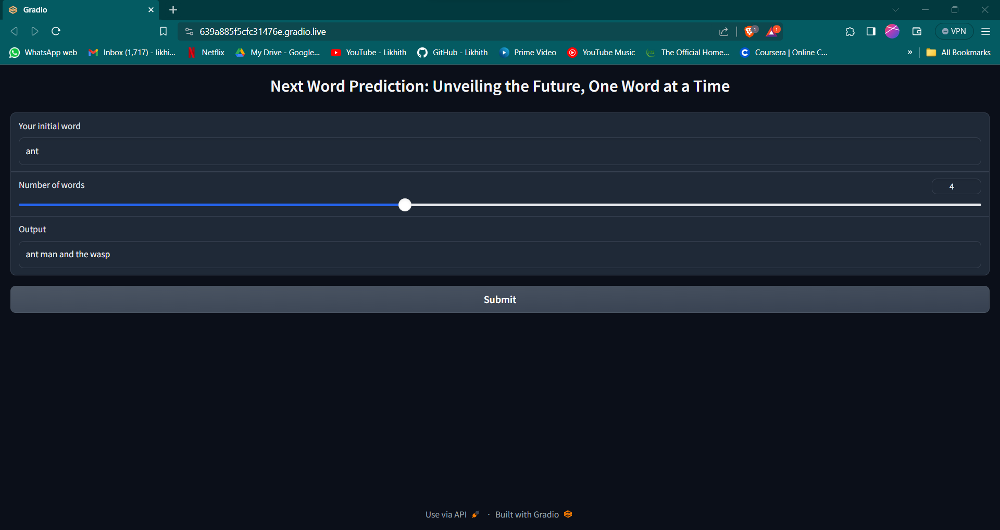

# Next Word Prediction

## Overview
The "Next Word Prediction" project leverages a Bidirectional LSTM model to predict sequences of words based on initial input. This project is particularly focused on predicting movie titles from initial word prompts, making it a useful tool for exploring patterns in movie title naming or for generating creative title ideas.

## Model
The project uses a Bidirectional LSTM architecture from TensorFlow to analyze and predict the next words in movie titles. The model has been trained on a dataset comprising 1,610 movie titles and has achieved a training accuracy of 81.49%. You can checkout the model training in `NWP_with_Bi_directional_LSTM.ipynb`.


## Dataset
The dataset, stored in `Movie_Titles.csv`, consists of 1,610 unique movie titles. These titles have been used to train the LSTM model to understand and predict the structure and common sequences in movie titles.

## Gradio Interface
A user-friendly Gradio interface has been set up for easy interaction with the model. Users can input an initial word and specify the number of words they want the model to predict. The model then outputs a sequence that can be interpreted as a potential movie title based on the input.



## How to Use
To use the prediction model:
1. Clone this repository to your local machine.
2. Ensure you have install the dependencies:
   ```bash
   pip install -r requirements.txt
3. Run the script to launch the Gradio interface:
   ```bash
   python app.py
4. Access the Gradio web interface in your browser, input your initial word and the desired length of the prediction, and see the predicted movie title.

## Requirements:
- Python 3.9+
- TensorFlow 2.x
- Gradio

## Contributions
Contributions are welcome! If you have suggestions or improvements, feel free to fork this repository and submit a pull request.
